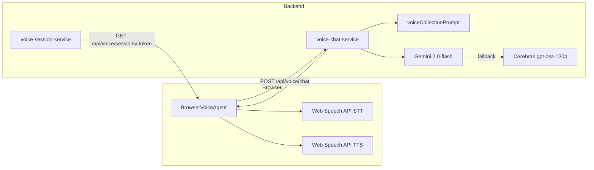

# V3 Summary

## Overview

**v3** is the third product iteration (git branch `v3`, merged into `main`). It evolved from `version-2-frontend` (single-page dashboard) into a multi-route **Control Room** with tiered follow-up actions and a browser-based AI collections voice agent.

The product name in the UI and docs is **UpFlow** (formerly Xero Kinetic).

---

## What Was Built

### Frontend — Control Room

- Multi-route app under `/app/*` with a React Query data layer ([`frontend/src/lib/kinetic/queries.ts`](frontend/src/lib/kinetic/queries.ts))
- Shared state via [`ControlRoomProvider`](frontend/src/components/control-room/control-room-context.tsx)
- New routes:
  - `/` — welcome hero with cash snapshot preview
  - `/app/` — overview + KPI strip
  - `/app/cash` — Cash & Revenue Lens
  - `/app/agents` — agent drafts band
  - `/app/actions` — follow-up actions (3-column escalation UI)
  - `/call/$token` — browser voice call page

### Follow-up & Communications Workflow

Tiered escalation logic lives in [`frontend/src/lib/kinetic/follow-up.ts`](frontend/src/lib/kinetic/follow-up.ts):

- **Email**: invoices **< 14 days** overdue
- **AI voice call**: invoices **≥ 14 days** overdue
- **Human escalation**: critical/high urgency (UI only, no automated backend yet)

Available actions from the Control Room:

- Send email payment reminder
- Send voice invite (SMTP email with link to `/call/{token}`)
- Start call now (opens browser call in a new tab)

Follow-up tracking and a resolved actions panel sync with Xero payment status via `/api/actions/follow-ups`.

### Backend — Voice & Communications

Six commits from `version-2-frontend..v3` (~4,300 lines across 52 files).

**New services:**

| Service | File | Purpose |
|---------|------|---------|
| Voice sessions | [`voice-session-service.ts`](src/lib/services/voice-session-service.ts) | Tokenized call sessions (24h TTL, in-memory) |
| Voice chat | [`voice-chat-service.ts`](src/lib/services/voice-chat-service.ts) | Turn-by-turn LLM replies |
| Call reports | [`voice-call-report-service.ts`](src/lib/services/voice-call-report-service.ts) | Post-call AI summary + email to finance team |
| Communications | [`communications-service.ts`](src/lib/services/communications-service.ts) | Email invites, Twilio scripted calls (legacy path) |
| Resolved actions | [`resolved-actions-service.ts`](src/lib/services/resolved-actions-service.ts) | Open/resolved follow-up tracking |

**New API routes** (in [`src/routes/api.ts`](src/routes/api.ts)):

| Method | Endpoint | Purpose |
|--------|----------|---------|
| POST | `/api/voice/sessions` | Create token + call URL from draft |
| GET | `/api/voice/sessions/:token` | Load session context for call page |
| POST | `/api/voice/chat` | Turn-by-turn agent reply |
| POST | `/api/voice/calls/complete` | Generate summary, email report, track follow-up |
| POST | `/api/communications/send-voice-invite` | Email customer a call link |
| POST | `/api/communications/send-email` | Payment reminder email |
| POST | `/api/communications/place-call` | Legacy Twilio scripted call |
| GET | `/api/actions/follow-ups` | Open + resolved follow-ups |

The health endpoint was extended with `browserVoiceConfigured`, `voiceConfigured`, and `emailConfigured` flags.

---

## Voice Agents — Different Model and Context Required

The voice agent stack is **separate** from the negotiation-draft LLM used elsewhere in the app. Voice agents need a different model and per-invoice context to hold a useful conversation with the customer.



### Different Voice Model (Not the Same as Draft Generation)

| Layer | What v3 uses | Notes |
|-------|-------------|-------|
| **Conversation brain** | Gemini `gemini-2.0-flash` (primary) or Cerebras `gpt-oss-120b` (fallback) | Configured via `GEMINI_API_KEY` / `AI_API_KEY` in [`.env.example`](.env.example). Optimized for short spoken replies (1–3 sentences, temp 0.4). **Not** the OpenAI structured-output model used for negotiation drafts. |
| **Speech in/out** | Browser Web Speech API (`speechSynthesis` + `SpeechRecognition`, `en-GB`) | Implemented in [`browser-voice-agent.tsx`](frontend/src/components/voice/browser-voice-agent.tsx). No dedicated TTS/STT provider wired in v3. |
| **Alternate path (not active)** | `VAPI_PUBLIC_KEY` + `VAPI_ASSISTANT_ID` | Keys are checked for `browserVoiceConfigured` but `BrowserVoiceAgent` does **not** use the Vapi SDK yet. A separate `voice` branch uses ElevenLabs — not merged. |
| **Legacy Twilio** | Scripted `<Say>` calls via `/api/communications/place-call` | Pre-v3 path, still present for 15+ day overdue invoices |

### Context Required So the Agent Can Talk to the User

The agent cannot hold a useful conversation without per-invoice context. This is built in two places:

1. **System prompt** — [`voiceCollectionPrompt.ts`](src/agents/voiceCollectionPrompt.ts) injects:
   - Customer name, invoice number, amount due, currency, days overdue
   - Optional early-settlement discount percent from draft metadata
   - Behavioral rules (polite, concise, no invented details, no aggression)

2. **Session + history** — [`voice-session-service.ts`](src/lib/services/voice-session-service.ts) creates a 24h token from a negotiation draft; [`voice-chat-service.ts`](src/lib/services/voice-chat-service.ts) passes the last **8 conversation turns** as Customer/Agent lines on each `/api/voice/chat` request.

Without `GEMINI_API_KEY` or `AI_API_KEY`, plus a valid session token with invoice context, the browser voice agent cannot generate replies. The greeting is hardcoded in the frontend; all subsequent turns depend on the backend LLM and context.

### Env Vars for Voice

```
GEMINI_API_KEY=
GEMINI_MODEL=gemini-2.0-flash
AI_API_KEY=          # Cerebras fallback
AI_MODEL=gpt-oss-120b
VAPI_PUBLIC_KEY=     # optional, not wired in BrowserVoiceAgent yet
VAPI_ASSISTANT_ID=
CALL_REPORT_EMAIL=   # post-call transcript destination
COMMUNICATIONS_TEST_EMAIL=  # overrides recipient in dev
```

---

## v3 Commit History

| Commit | Summary |
|--------|---------|
| `cbdaad1` | Backend voice services + voice collection prompt |
| `5afadb0` | Kinetic API client refactor, queries, follow-ups |
| `e7b1144` | `/app` + `/call` routes, router tree |
| `40cf09d` | Control room components, voice agent, UI sheet |
| `5cc6e41` | Env example + sample action flow |
| `bc1dc7c` | Voice call completion endpoint + frontend integration |

---

## Key Files

| Area | File |
|------|------|
| Browser voice UI | [`frontend/src/components/voice/browser-voice-agent.tsx`](frontend/src/components/voice/browser-voice-agent.tsx) |
| Call page | [`frontend/src/routes/call/$token.tsx`](frontend/src/routes/call/$token.tsx) |
| Actions page | [`frontend/src/routes/app/actions.tsx`](frontend/src/routes/app/actions.tsx) |
| API client | [`frontend/src/lib/kinetic/api.ts`](frontend/src/lib/kinetic/api.ts) |
| Voice prompt | [`src/agents/voiceCollectionPrompt.ts`](src/agents/voiceCollectionPrompt.ts) |

---

## What v3 Is Not

- **Not** Execution Plan Phase 3 (AI negotiator agents — Person 2 scope in [PERSON_2_BUILD_GUIDE.md](PERSON_2_BUILD_GUIDE.md))
- **Not** the unmerged `voice` branch (ElevenLabs TTS + escalation endpoints)
- Voice endpoints are **not yet documented** in [BACKEND_CONTRACT.md](BACKEND_CONTRACT.md)
